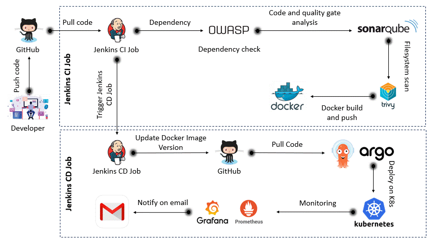
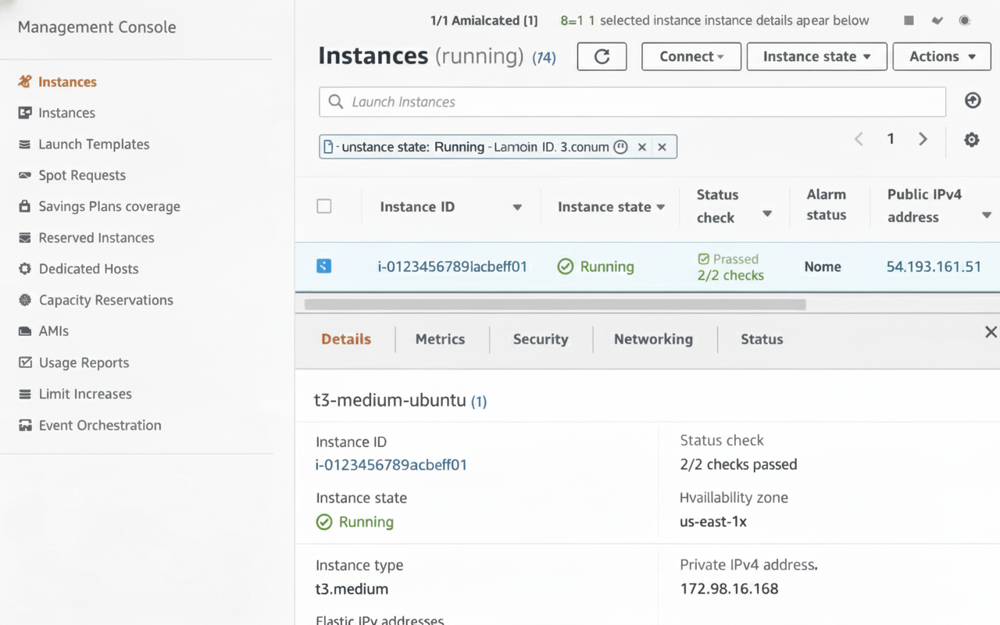
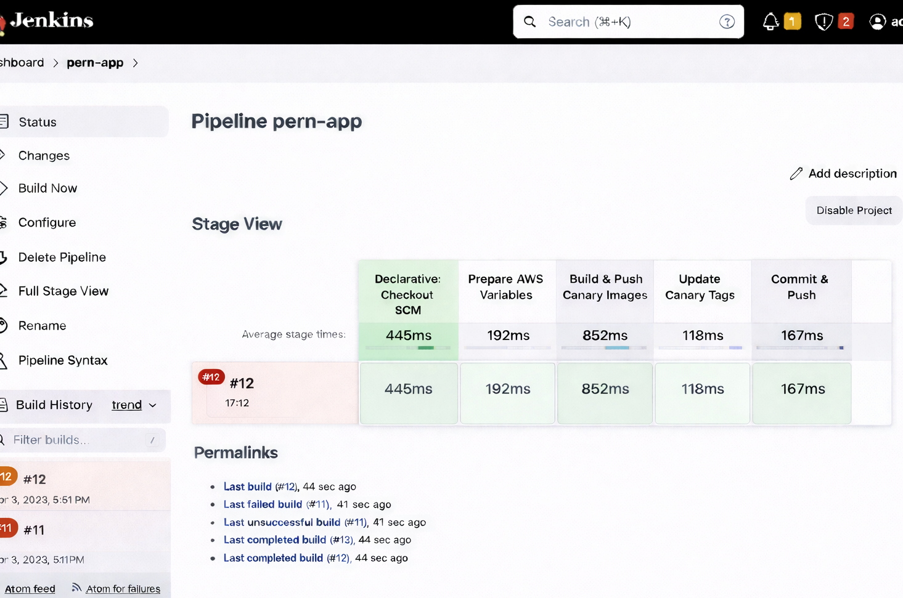
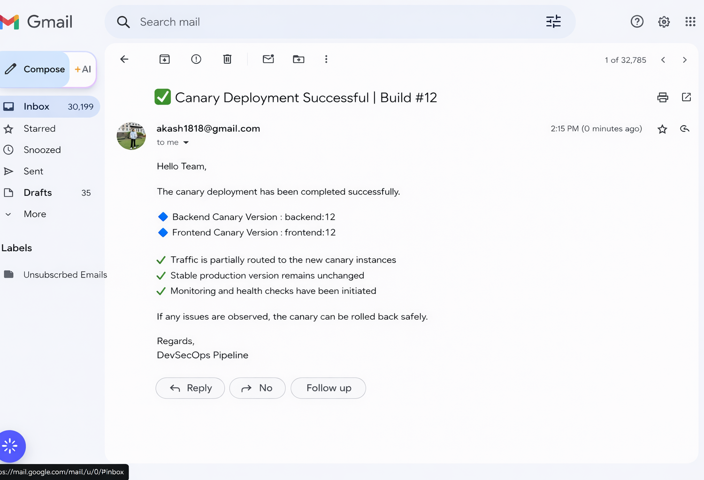
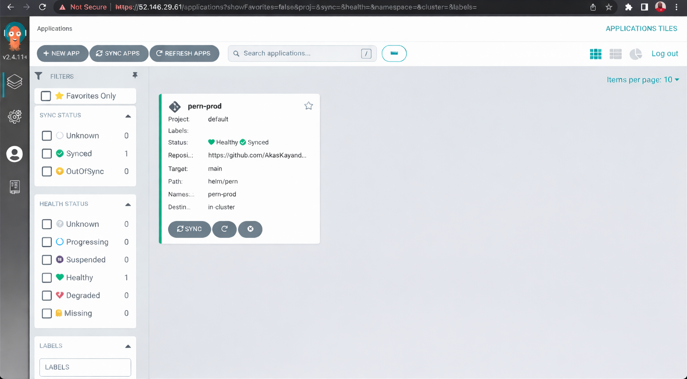
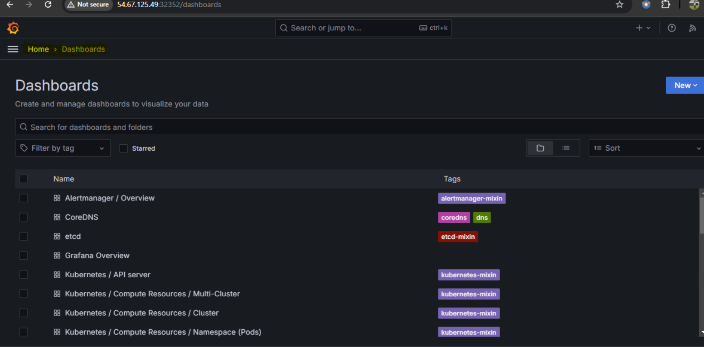
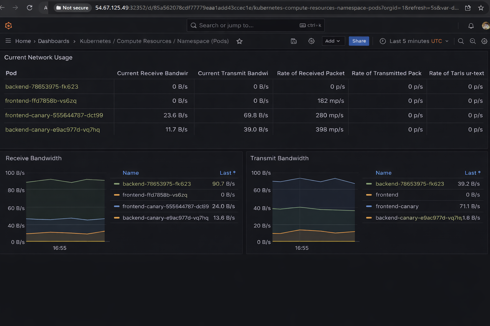

# 🚀 End-to-End DevOps Project: PERN Application on AWS EKS

## 📌 Project Overview

This project demonstrates a **production-grade DevOps implementation** for deploying a **PERN (PostgreSQL, Express, React, Node.js)** application on **AWS EKS**, using **modern CI/CD (Jenkins),Helm,GitOps, Canary Deployment strategies, Monitoring (Prometheus & Grafana)**.

The goal of this project is to showcase **real-world DevOps practices** including:

* Infrastructure as Code (Terraform)
* Containerization (Docker)
* AWS (EC2, EKS, ECR, IAM)
* CI with Jenkins
* CD with Argo CD (GitOps)
* Kubernetes package management (Helm)
* Canary deployments
* Monitoring with Prometheus & Grafana
* Email notifications for deployment status
* Use Velero for Backup and Restore

---
## 🏗 Architecture Overview

<p align="center">
  
</p>

## 🏗️ Workflow

```
Developer → GitHub
              ↓ (Webhook)
           Jenkins (CI)
              ↓
      Build & Push Images → AWS ECR
              ↓
      Update Helm values (canary tags)
              ↓
            GitHub Repo
              ↓
          Argo CD (CD)
              ↓
           AWS EKS Cluster
              ↓
     Canary + Stable Deployments
              ↓
        Nginx Ingress Controller
              ↓
           Application Users
```

Monitoring:

```
EKS → Prometheus → Grafana
```
## Email Notifications 

Jenkins sends email alerts:

✅ Deployment Success

❌ Deployment Failure

---

## 🧰 Tech Stack

| Category            | Tools                      |
| ------------------- | -------------------------- |
| Cloud               | AWS                        |
| IaC                 | Terraform                  |
| Containers          | Docker                     |
| Registry            | Amazon ECR                 |
| Orchestration       | Kubernetes (EKS)           |
| CI                  | Jenkins                    |
| CD                  | Argo CD                    |
| Packaging           | Helm                       |
| Deployment Strategy | Canary Deployment          |
| Ingress             | Nginx Ingress Controller   |
| Monitoring          | Prometheus, Grafana        |
| Database            | Neon PostgreSQL (Managed)  |
| Backup              | Velero Backup              |
---

## 🔹 Step-by-Step Implementation

---
## 🧩 Application Setup (PERN Stack)

* Cloned the PERN application repository
* Frontend: React (Vite)
* Backend: Node.js + Express
* Database: **Neon PostgreSQL (external managed DB)**

---

## 🧱 Infrastructure Setup (Terraform)

* Created an **EC2 instance** using Terraform
- 🔗 [EC2](./terraform/ec2.tf)

<p align="center">
  
</p>
---
* Installed required tools:

  * Docker
  * AWS CLI
  * kubectl
  * Eksctl
  * Helm
  * Jenkins
* This EC2 instance acts as the **CI server (Jenkins)**

---

## 🐳 Dockerization

* Created **separate Dockerfiles** for:

  * Frontend
  * Backend

* Used **multi-stage Docker builds** for optimized frontend images
* Configured build-time environment variables (e.g. `VITE_BASE_URL=/api`)
### Dockerfiles
- 🔗 [Frontend](./client/Dockerfile)
- 🔗 [Backend](./server/Dockerfile)
---

---

## 📦 Container Registry (Amazon ECR)

* Created ECR repositories for:
  * Frontend
  * Backend

* Manually pushed images **for first-time bootstrap**
* Jenkins later automates image tagging & pushing

<p align="center">
  
</p>
---

## ☸️ Kubernetes Cluster (EKS)

* Created AWS EKS cluster
* Configured worker nodes
* Installed:

  * AWS ALB Ingress Controller
  * Helm Chart
  * ArgoCD

<p align="center">
  
</p>
---

## 🎯 Helm Charts & Canary Deployment

* Created Helm chart for the PERN application
* Implemented **Canary Deployment strategy**:
### Helm Chart
- 🔗 [Helm Chart](./helm/pern/)

### Deployment Structure

* Stable deployment
* Canary deployment
* Traffic splitting between Stable and Canary versions is controlled by adjusting replica counts
within the Helm chart. This allows gradual rollout and validation before full promotion.


### Helm Values

* `backend.canary.tag`
* `frontend.canary.tag`

Only **canary image tags** are updated during CI runs

---

## 📈 CI Automation (Jenkins)

### Jenkins Pipeline Responsibilities

* Triggered automatically via **GitHub Webhook**
* Checkout code
* Build Docker images (Frontend,Backend)
* Push images to ECR
* Update Helm `values.yaml` with new canary image tags
* Jenkins follows GitOps principles by committing updated Helm values back to GitHub,
which Argo CD then syncs to the cluster.
* Jenkins sends email alerts: ✅ Pipeline Success ❌ Pipeline Failure

### Security

* AWS credentials stored in Jenkins credentials manager
* GitHub PAT used for repo access
* Secrets never hardcoded

<p align="center">
  
</p>
---

### Jenkins sends email alerts
<p align="center">
  
</p>
---


## 🚀 CD with Argo CD (GitOps)

* Installed Argo CD in EKS cluster
* Connected GitHub repository to Argo CD
* Created Argo CD Application pointing to Helm chart

* - 🔗 [Argo CD Application](./argocd/argocd-app.yaml)

### GitOps Flow

```
Git Commit → Argo CD detects change → Sync → Deploy to EKS
```

* Jenkins handles **CI only**
* Argo CD handles **CD only**

<p align="center">
  
</p>
---


## 🌐 Ingress & Application Access

* Used **Nginx Ingress Controller**
* Single domain for frontend & backend
* Backend exposed under `/api`
* Frontend exposed under `/`

Example:

```
https://pern.example.com
https://pern.example.com/api
```

* A real domain was not purchased for this project.
The domain name was mapped locally to the Nginx Ingress Controller IP using /etc/hosts for testing purposes.


<p align="center">
  
</p>
---  

## 📊 Monitoring (Prometheus & Grafana)

* Installed **kube-prometheus-stack** via Helm

```bash
helm repo add prometheus-community https://prometheus-community.github.io/helm-charts
kubectl create namespace monitoring
helm install stable prometheus-community/kube-prometheus-stack -n monitoring
```

* Components:

  * Prometheus (metrics collection)
  * Grafana (visualization)
  * Alertmanager (Email)

### Prometheus & Grafana Access

* Initially exposed via NodePort for testing
* Can be exposed via ALB Ingress in production

### Metrics Collected

* Pod CPU & memory
* Node metrics
* Canary vs Stable performance comparison

---
<p align="center">
  
</p>
---

<p align="center">
  
</p>

---
<p align="center">
  
</p>
---

### 💾 Backup Strategies
## Velero is used to demonstrate cluster-level backup and disaster recovery capabilities.
## Use Velero for Backup and Restore:

* Install Velero:
```bash
velero install --provider aws --bucket <bucket-name> --secret-file <credentials-file> --backup-location-config region=<region>
```

## Velero is used to demonstrate cluster-level backup and disaster recovery capabilities.

* Create a Backup:

```bash
velero backup create my-backup --include-namespaces pern-prod
```

## 🧹 Clean Up
* Delete eks cluster
```bash 
eksctl delete cluster --name=pern-eks --region=us-east-1 
terraform destroy
```

---

## 🔐 Security Best Practices

* IAM roles for EKS & Jenkins
* Kubernetes secrets for sensitive data
* Jenkins credentials manager
* GitHub PAT for secure repo access

---


## 🎯 Key Learnings & Outcomes

* End-to-end CI/CD pipeline implementation
* GitOps-based deployment using Argo CD
* Canary deployment strategy on Kubernetes
* Production-style monitoring setup
* Real-world DevOps tooling integration


## 🧑‍💻 Author

**Akash Kayande**
DevOps Engineer | AWS | Kubernetes | CI/CD | GitOps

---

## ⭐ If you like this project

Give it a ⭐ on GitHub and feel free to fork or raise issues!
