# 🚀 PERN Application Deployment on AWS EKS with Jenkins CI/CD, GitOps, Helm, Canary deployment, Monitoring

## 📌 Description

This project demonstrates a complete end-to-end deployment of a **PERN (PostgreSQL, Express, React, Node.js) application** on **Amazon EKS (Elastic Kubernetes Service)** using modern cloud-native tools and practices.

It covers infrastructure provisioning, containerization, Kubernetes deployment, progressive delivery strategies, CI/CD automation, and monitoring — all integrated into a scalable and production-ready architecture.

---

## 📖 Overview

The project starts by provisioning AWS infrastructure using **Terraform**, including VPC, EKS cluster, and container registry (ECR).

The application is containerized using Docker and deployed on Kubernetes using **Helm charts** for better configuration management and reusability.

To ensure safe and reliable releases, **Canary Deployment strategy** is implemented using **Argo Rollouts**, allowing gradual traffic shifting and automatic rollback based on application health.

A fully automated **CI/CD pipeline** is built using **Jenkins**, which handles building, testing, containerization, and deployment updates. The deployment process follows a **GitOps approach** using **Argo CD**, ensuring that the Kubernetes cluster state always matches the desired state stored in Git.

For observability, the system integrates **Prometheus** and **Grafana** to monitor both infrastructure and application-level metrics, providing real-time insights into system performance and health.

---

## 🧰 Tech Stack

### ☁️ Cloud & Infrastructure

* AWS (EKS, EC2, ECR, IAM, VPC)
* Terraform (Infrastructure as Code)

### 🐳 Containerization

* Docker

### ☸️ Container Orchestration

* Kubernetes (Amazon EKS)

### 📦 Deployment & Packaging

* Helm (Kubernetes package manager)

### 🚀 Deployment Strategy

* Argo Rollouts (Canary Deployment)

### 🔄 CI/CD & GitOps

* Jenkins (CI/CD Automation)
* Argo CD (GitOps Continuous Delivery)
* GitHub (Source Code Management)

### 🌐 Networking

* NGINX Ingress Controller

### 📊 Monitoring & Observability

* Prometheus (Metrics collection)
* Grafana (Visualization dashboards)

### 💻 Application Stack

* PostgreSQL
* Express.js
* React.js
* Node.js
---

## 🔹 Step-by-Step Implementation Of Project
---

## 🛠️ Step 1: Setup Terraform & AWS

### 🔹 Install Terraform

* Download from: [https://developer.hashicorp.com/terraform/downloads](https://developer.hashicorp.com/terraform/downloads)
* Verify installation:

```bash
terraform -v
```

### 🔹 Configure AWS CLI

```bash
aws configure
```

Provide:

* AWS Access Key
* AWS Secret Key
* Region (e.g., `us-east-1`)

### 🔹 Required AWS Permissions

Ensure your IAM user has access to:

* VPC
* EC2
* EKS
* ECR
* IAM
* S3
---

## ☁️ Step 2: Infrastructure Provisioning using Terraform

We use **official Terraform modules**.
---

### 🔹 1. Networking Infrastructure (VPC)

Using **Terraform AWS VPC Module**

#### Resources Created:

* VPC
* Public Subnets
* Private Subnets
* Internet Gateway (IGW)
* NAT Gateway
* Route Tables
---

### 🔹 2. EKS Cluster Infrastructure

Using **Terraform AWS EKS Module**

#### Resources Created:

* EKS Cluster (Control Plane)
* Worker Nodes (Node Groups)
* IAM Roles & Policies:

  * Cluster Role
  * Node Role

#### Features:

* Managed Kubernetes Cluster
* Auto-scaling worker nodes
* Secure IAM integration

<p align="center">
  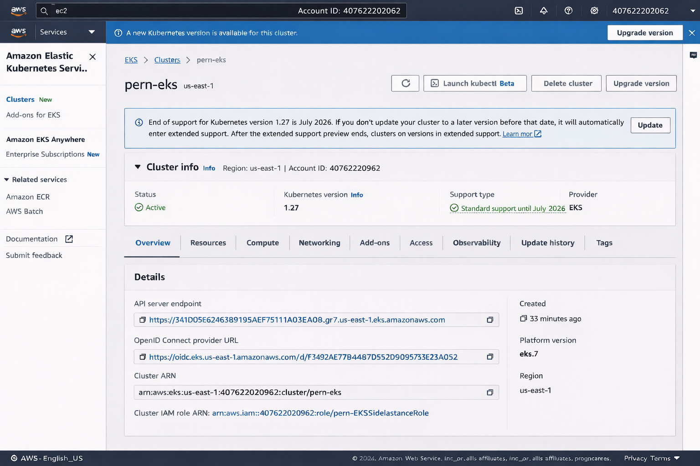
</p>
---

### 🔹 3. Amazon ECR (Container Registry)

Create repositories for:

* Frontend
* Backend

#### Purpose:

* Store Docker images
* Used by Kubernetes deployments

<p align="center">
  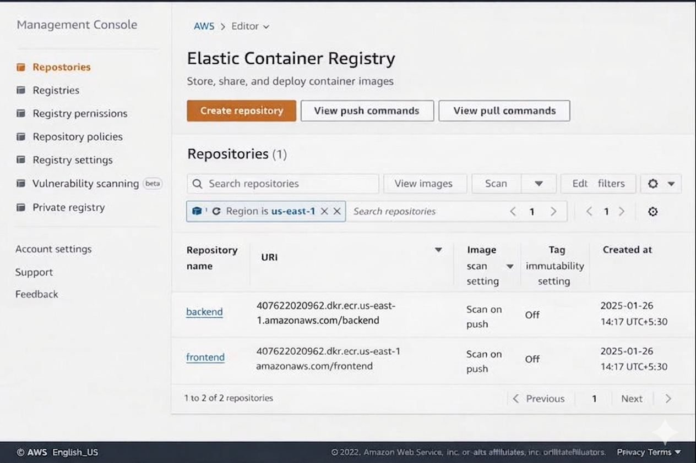
</p>

---

### 🔹 4. EC2 Instance (Utility Server)

Create an EC2 instance to act as a **DevOps control machine**

#### Purpose:

* Build Docker images
* Push images to ECR
* Apply Kubernetes manifests
* Manage cluster

---

## ⚙️ EC2 Setup for Project
---
<p align="center">
  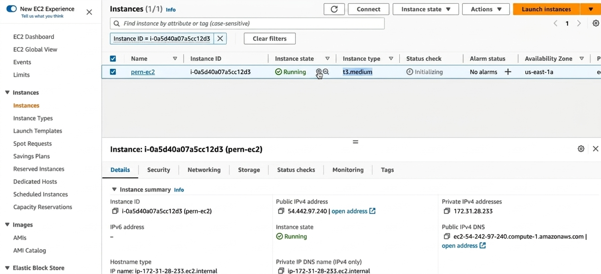
</p>
---
We provision an EC2 instance to act as a central machine for building, scanning, and deploying our application to the Kubernetes cluster.

* First, connect to your AWS EC2 instance using SSH

### 🛠️ Install & Configure Required Tools

* After connecting to the EC2 instance, install the following essential tools for your DevSecOps pipeline:

* **AWS CLI**
  Used to interact with AWS services and configured with appropriate credentials for secure access.
### 🔹 Configure AWS CLI

```bash
aws configure
```
* Provide Access Key
* Secret Key
* Region

* **Docker**
  Enables building and managing container images for the application.

### 🔹 Install Docker Engine

```bash
sudo apt update
sudo apt install docker.io -y
sudo systemctl start docker
sudo systemctl enable docker
```

* **Trivy**
  Used for vulnerability scanning of Docker images to ensure security compliance.

* **Git**
  Helps in cloning repositories and managing source code versions.

* **Kubectl**
  Configured to connect with the EKS cluster for deploying and managing Kubernetes resources.

### 🔹 Update kubeconfig
* connect with the EKS cluster

```bash
aws eks update-kubeconfig \
--region us-east-1 \
--name pern-eks
```

* **Helm**
  Used as a package manager for Kubernetes and for creating reusable deployment templates (Helm charts).

---
## 🐳 Build & Push Docker Images to AWS ECR

In this step, we containerize both the frontend and backend applications and push the images to Amazon ECR (Elastic Container Registry).

### 🔹 DockerFiles

- Create separate **Dockerfiles** for:
  - Frontend application
  - Backend application

- 🔗 [Backend Dockerfile](https://github.com/Akashkayande/app-code-jenkins/blob/main/server/Dockerfile)
- 🔗 [frontend Dockerfile](https://github.com/Akashkayande/app-code-jenkins/blob/main/client/Dockerfile)

### 🔹 Build Backend Image

```bash
docker build -t backend ./server
```

### 🔹 Build Frontend Image

```bash
docker build -t frontend ./client
```

### 🔹 Tag Images for ECR

```bash
docker tag backend:latest <ECR_REGISTRY>/backend:latest
docker tag frontend:latest <ECR_REGISTRY>/frontend:latest
```
### 🔹 Authenticate Docker to ECR

```bash
aws ecr get-login-password --region ap-south-1 \
| docker login --username AWS --password-stdin <ECR_REGISTRY>
```

## 🚀 Push Docker Images to ECR

```bash
docker push <ECR_REGISTRY>/backend:latest
docker push <ECR_REGISTRY>/frontend:latest
```

### 📌 Outcome

- Frontend and Backend applications are containerized.
- Docker images are securely stored in AWS ECR.
- These images are ready to be deployed on Kubernetes (EKS).

---
## 🚀 PERN App Deployment on AWS EKS using Helm


### 🧰 What is Helm?

**Helm** is a package manager for Kubernetes that helps you:

* 📦 Define, install, and upgrade Kubernetes applications
* ♻️ Reuse Kubernetes manifests using templates
* ⚙️ Manage environment-specific configurations using values files
* 🚀 Simplify deployments with version control and rollbacks

---

## 🏗️ Project Workflow

### 1️⃣ Install Helm

Install Helm CLI on your system:

```bash
# Linux / Mac
curl https://raw.githubusercontent.com/helm/helm/main/scripts/get-helm-3 | bash


# Verify installation
helm version
```
---

### 2️⃣ Create Helm Chart

Create a Helm chart for the PERN application:

```bash
helm create pern
cd pern
```

This generates a standard chart structure:

```
pern/
│── templates/
│── values.yaml
│── Chart.yaml
```

---

### 3️⃣ Define Kubernetes Resources

Inside the `templates/` folder, define all required Kubernetes resources:

* 🟢 Frontend Rollouts & Service
* 🔵 Backend Rollouts & Service
* 🟣 Secrets
* 🌐 Ingress (for external access)

- 🔗 [templates/](helm/pern/templates/)
---
### 4️⃣ Use values.yaml for Configuration

Helm allows you to inject dynamic values using `values.yaml`.

Example:

```yaml
backend:
  replicaCount: 2
  image: myrepo/backend:latest

frontend:
  replicaCount: 2
  image: myrepo/frontend:latest
```

---

### 5️⃣ Create Environment-Specific Values

To support multiple environments, create separate values files:

* `values-dev.yaml`
* `values-staging.yaml`
* `values-prod.yaml`

Example: [prod-values.yaml](helm/pern/prod-values.yaml)
---

### 6️⃣ Deploy to EKS using Helm

Deploy the application using Helm:

```bash
helm install pern-release ./pern -f prod-values.yaml
```

## 🌍 Why Use Helm?

* 🔁 Reusable Kubernetes configurations
* 📂 Clean and modular structure
* 🌐 Easy multi-environment deployments
* 🔄 Simplified upgrades and rollbacks
* ⚡ Faster and more scalable deployments

---

## 🧠 Key Concept

Instead of writing separate Kubernetes YAML files for each environment, we:

👉 Define templates once
👉 Inject values dynamically using `prod-values.yaml`
👉 Reuse the same chart across environments


### 🚀 Canary Deployment with Argo Rollouts (Auto Rollback Enabled)
---
Here’s a **simple, small README block** 👇

---

## 🐤 What is Canary Deployment?

**Canary Deployment** is a release strategy where a new version of an application is rolled out to a **small percentage of users first**, instead of everyone at once.

### ⚙️ How It Works

* Deploy new version alongside the old (stable) version
* Send a small amount of traffic (e.g., 10–20%) to the new version
* Monitor performance and errors
* Gradually increase traffic if everything is stable
* Roll back instantly if issues are detected

### 🎯 Why Use It?

* Reduces deployment risk
* Detects issues early
* Enables **zero-downtime releases**
---

## 🛠️ Step-by-Step Implementation

### 1️⃣ Install Argo Rollouts using Helm

* Add Helm repo for Argo Rollouts
* Install controller in Kubernetes cluster

```bash
helm repo add argo https://argoproj.github.io/argo-helm


helm repo update

helm install argo-rollouts argo/argo-rollouts \
  --namespace argo-rollouts \
  --create-namespace
```
👉 This installs:

* Rollout controller (manages deployments)
* CRDs (Rollout, AnalysisTemplate, etc.)

---
* Verify Installation
```bash
kubectl get pods -n argo-rollouts
```

* Access argo-rollouts dashboard 
```bash
kubectl port-forward svc/argo-rollouts-dashboard -n argo-rollouts 3100:3100
```
<p align="center">
  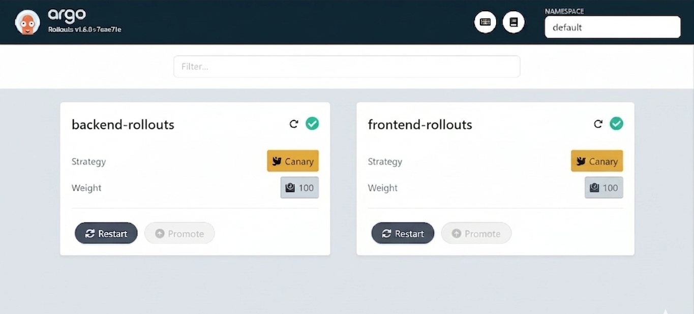
</p>
---

### 2️⃣ Install Argo Rollouts CLI

Used to manage and debug rollouts:

* Get rollout status
* Promote or abort rollout
* View canary progress

```bash
# Linux / WSL
curl -LO https://github.com/argoproj/argo-rollouts/releases/latest/download/kubectl-argo-rollouts-linux-amd64
chmod +x kubectl-argo-rollouts-linux-amd64
mv kubectl-argo-rollouts-linux-amd64 /usr/local/bin/kubectl-argo-rollouts

# Verify
kubectl argo rollouts version
```
---

### 3️⃣ Replace Deployment with Rollout Resource

Instead of Kubernetes `Deployment`, define a `Rollout` for:

* **Frontend**
* **Backend**

This enables advanced deployment strategies like Canary.
[frontend-rollout.yaml](helm/pern/templates/frontend-rollout.yaml)
[backend-rollout.yaml](helm/pern/templates/backend-rollout.yaml)

---

## 🔀 Traffic Splitting (Canary Strategy)

Traffic is gradually shifted between **stable** and **canary** versions using Argo Rollouts with NGINX Ingress.

* 🟢 **Stable Service** → `backend-service` (current version)
* 🟡 **Canary Service** → `backend-canary-service` (new version)

### 📊 Traffic Flow

* **20% Canary / 80% Stable** → Initial testing
* **50% Canary / 50% Stable** → Mid validation
* **80% Canary / 20% Stable** → Near full rollout
* **100% Canary** → Full release (becomes stable)

👉 At each stage:

* Traffic weight is updated automatically
* Metrics are validated via Prometheus
* If issues detected → rollback to stable version

### ⚙️ How It Works

* NGINX Ingress dynamically routes traffic
* Argo Rollouts controls traffic weights
* No downtime during transitions

---

### 6️⃣ Auto Rollback If New Version Failed:

To enable monitoring:

* Application exposes at metrics endpoint (e.g. `/metrics`)
[app-matrix.js](https://github.com/Akashkayande/app-code-jenkins/blob/main/server/app-matrix.js)

### 7️⃣ Configure Prometheus Monitoring

Prometheus is used to:

* Scrape application metrics
* Store data in **TSDB (Time Series Database)**
* Provide query interface (PromQL)

---

### 📊 Analysis Template (Auto Rollback)

This project uses an **AnalysisTemplate** in Argo Rollouts to automatically validate each canary step using metrics from Prometheus.

[AnalysisTemplate.yaml](helm/pern/templates/backend-auto-rollback.yaml)

### ⚙️ What It Does

* Monitors **success rate of HTTP requests**
* Runs checks every **30 seconds**
* Uses **PromQL query** to evaluate application health
* Triggers **auto rollback** if threshold is not met

### 📈 Validation Logic

* ✅ Success Condition → success rate **> 95%**
* ❌ Failure Condition → below threshold even once (`failureLimit: 1`)

👉 If the condition fails:

* Rollout is **immediately aborted**
* Traffic is shifted back to the stable version

### 🧠 How It Works

* Prometheus collects request metrics (`http_requests_total`)
* Argo Rollouts queries Prometheus during each canary step
* Based on results, rollout either:

  * Continues (healthy)
  * Rolls back (unhealthy)

---

### 🎯 Key Benefit

Ensures only **healthy versions** are promoted, enabling **fully automated and safe deployments** without manual intervention.


## 🧠 Why This Approach?

| Problem                | Solution                 |
| ---------------------- | ------------------------ |
| Risky full deployments | Gradual rollout          |
| No visibility          | Prometheus monitoring    |
| Manual rollback        | Automated rollback       |
| Downtime               | Zero downtime deployment |
---
## 🌐 Exposing Application using Ingress (ALB Controller)

## 📌 Problem Statement

By default, Kubernetes services are **not accessible outside the cluster**:

* `ClusterIP` → Internal communication only
* `NodePort` → Limited and not production-friendly
* No built-in HTTPS, routing, or load balancing

👉 This creates problems:

* ❌ Cannot access app from internet
* ❌ No path-based routing (frontend/backend separation)

---

## ✅ Solution

We solve this using:

* **Kubernetes Ingress** → Defines routing rules
* **Nginx Ingress Controller** → Creates and manages Load Balancer

👉 Result:

* 🌐 Public access to app
* 🔀 Path-based routing
* 🔒 HTTPS support
* ⚖️ Managed load balancing

---

## 🏗️ Architecture Flow

```bash id="r9y7cx"
User → ALB (Ingress) → Services → Pods → Application
```

### Flow Explanation

1. User hits nginx load balancer DNS URL
2. LB checks Ingress rules
3. Routes request:

   * `/` → Frontend service
   * `/api` → Backend service
4. Service forwards to pods
5. Pods serve application response

---

## ⚙️ Components & How They Work

### 1. Ingress

* Acts as **entry point** for external traffic
* Defines routing rules (path/domain based)

### 2. ALB Ingress Controller

* Watches Ingress resources
* Automatically:

  * Creates load balancer
  * Configures listeners (HTTP/HTTPS)
  * Applies routing rules


---

## 📄 Ingress Configuration (Path-Based Routing)

* Define Ingress Rules
* Configure HTTPS-based Ingress
* Implement path-based routing:
* / → Frontend Service
* /api → Backend Service
---

## 🚀 Apply Ingress

- 🔗 [ingress.yaml](/helm/pern/templates/ingress.yaml)

```bash id="w7jz0h"
kubectl apply -f ingress.yaml
```

---
### 5. Install Nginx Controller using Helm

```bash id="u2n4wz"
helm repo add ingress-nginx https://kubernetes.github.io/ingress-nginx
helm repo update

helm install ingress-nginx ingress-nginx/ingress-nginx \
  --namespace pern-prod
```
---

## 🔍 Get  DNS

```bash id="2r6b1x"
kubectl get ingress -n pern-prod
```
* We Use The Dummy Host for testing:
* Edit /etc/hosts:
*  Add:
    <EXTERNAL-IP> pern.example.com

* <EXTERNAL-IP> =>ALB DNS IP
---
<p align="center">
  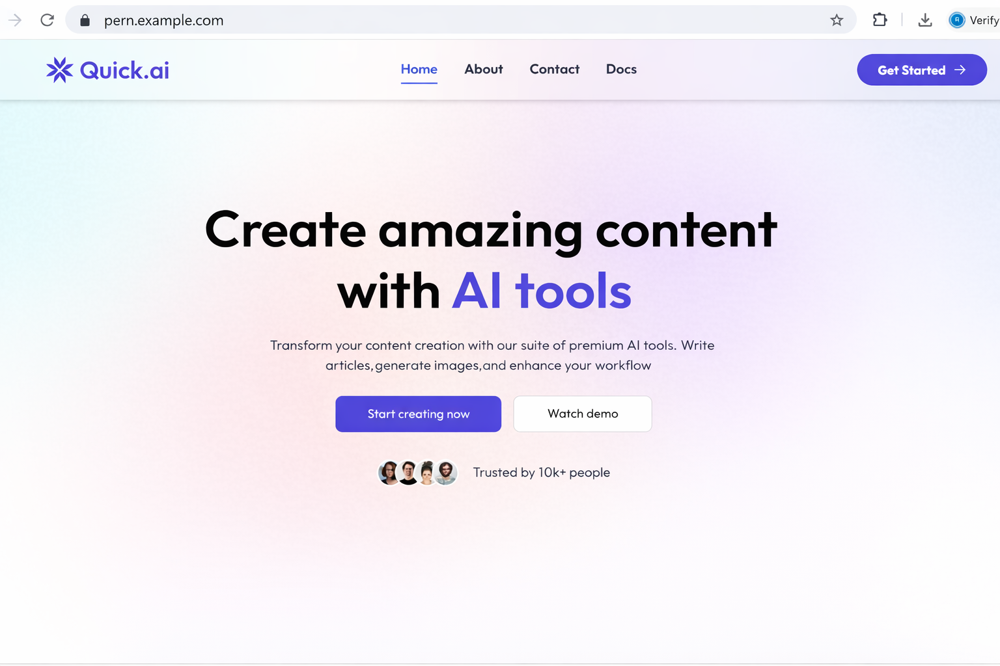
</p>

---

### 🚀 CI/CD Automation for EKS Deployment using Jenkins

### 📌 Overview

We deploy our application on **Amazon EKS** using **Helm** and **Argo Rollouts** for advanced deployment strategies like Canary.

Initially, the deployment process was **manual**, which involved:

* Building Docker images locally
* Pushing images to **Amazon ECR**
* Updating Helm `values.yaml` with new image tags
* Running `helm install/upgrade` manually

While this worked, it was **time-consuming, manual Work, error-prone, and not scalable**.

---
### 🔍 What is Jenkins?

Jenkins is an open-source **automation server** used to build, test, and deploy applications.

### ⚙️ Why Jenkins?

* Eliminates manual deployment steps
* Ensures consistent and reliable deployments
* Enables full DevOps automation
* Supports CI (Continuous Integration) and CD (Continuous Deployment)

### 🧠 Benefits of Automation

* 🚀 Faster deployments
* ❌ Reduced human errors
* 🔄 Consistent process
* 🔐 Integrated security scanning
* 📈 Scalable and production-ready

### ✅ Automated CI/CD Pipeline using Jenkins

To eliminate manual work, we implemented a **CI/CD pipeline using Jenkins** that automates the entire process:

### 🔄 Automated Workflow

1. Developer pushes code to GitHub
2. GitHub webhook triggers Jenkins pipeline
3. Jenkins performs:

   * ✅ Build Docker images
   * 🔐 Scan images (security scan)
   * 📦 Push images to Amazon ECR
   * ✏️ Update Helm chart (image tag)
   * 🚀 Deploy to EKS using Helm
4. Argo Rollouts manages deployment strategy (Canary)
---

### 🚀 CI/CD Pipeline Implementation using Jenkins

## ⚙️ Step 1: Jenkins Setup

### 1. Install Java (Prerequisite)

Jenkins is a Java-based application, so Java must be installed first.

```bash
sudo apt update
sudo apt install openjdk-17-jdk -y
java -version
```
---

### 2. Install Jenkins

```bash
wget -q -O - https://pkg.jenkins.io/debian/jenkins.io.key | sudo apt-key add -
sudo sh -c 'echo deb https://pkg.jenkins.io/debian binary/ > /etc/apt/sources.list.d/jenkins.list'

sudo apt update
sudo apt install jenkins -y
```
---

Jenkins will run on:

```
http://<your-server-ip>:8080
```
<p align="center">
  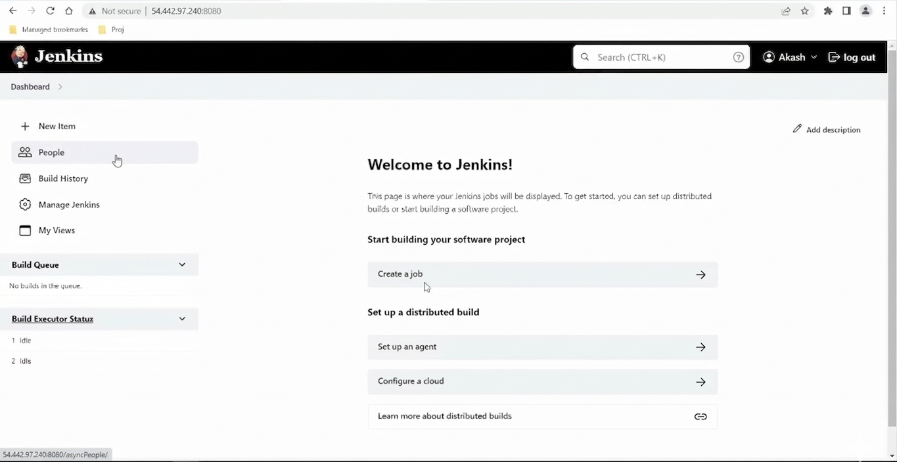
</p>

---

### 5. Install Required Plugins

During setup, install **Suggested Plugins**, and ensure the following are available:

* Git Plugin
* Pipeline Plugin
* Email Extension Plugin
* Docker Plugin
* Stage View Plugin

---

## 🔧 Step 2: Create Jenkins Pipeline Job

1. Go to Jenkins Dashboard
2. Click **New Item**
3. Select **Pipeline**
4. Enter Job Name → Click OK

---

### ⚙️ Configure Pipeline

* Scroll to **Pipeline Section**
* Select:

```
Definition: Pipeline script from SCM
```

* Configure SCM:
```
SCM: Git
Repository URL: https://github.com/Akashkayande/app-code-jenkins.git
Branch: main
Script Path: Jenkinsfile
```
* Go to **Build Triggers**
* Enable:

```
GitHub hook trigger for GITScm polling
```
---

## 🔔 Step 3: Setup GitHub Webhook (Auto Trigger)

### 📌 Why Webhook?

To automatically trigger Jenkins pipeline whenever code is pushed to GitHub.

---

### 🔧 Create GitHub Webhook

1. Go to your GitHub repository
2. Click **Settings → Webhooks → Add Webhook**

Fill the details:

* **Payload URL:**

```
http://<your-jenkins-ip>:8080/github-webhook/
```
* **Content Type:**
```
application/json
```
* **Events:**
```
Just the push event
```
* Click **Add Webhook**
---

## 🔄 CI/CD Flow

```text
Developer pushes code to GitHub
            ↓
GitHub repository is updated
            ↓
GitHub Webhook is triggered
            ↓
Webhook sends request to Jenkins
            ↓
Jenkins Pipeline starts automatically
            ↓
Pipeline executes stages (Build, Test, Deploy)
```

## 📊 Workflow Summary

* Automated pipeline using Jenkins
* Integrated with GitHub via webhook
* No manual trigger required
* Supports continuous integration & delivery
---

### 🚀 Jenkins CI/CD Pipeline

[Jenkins-pipeline](https://github.com/Akashkayande/app-code-jenkins/blob/main/Jenkinsfile)

## 🧩 Pipeline Overview

The pipeline automates the complete lifecycle:

1. **Checkout Source Code**
2. **Install Dependencies (Frontend & Backend)**
3. **Run Tests**
4. **Build Docker Images**
5. **Security Scan using Trivy**
6. **Push Images to AWS ECR**
7. **Update Helm Charts (GitOps Repo)**


* Clones GitOps repository
* Updates Helm values file:

```yaml
helm/pern/prod-values.yaml
```

* Updates:

```yaml
backend.image.tag
frontend.image.tag
```

* Commits and pushes changes to GitHub

✅ This triggers **ArgoCD auto-sync**, which deploys the new version to EKS.

9. **Cleanup**
10. **Email Notifications (On Success & Fail)**
---
## 🏗️ Architecture Flow

```
Developer → GitHub (App Code)
        ↓
   Jenkins Pipeline
        ↓
 Build + Test + Scan
        ↓
 Docker Images → AWS ECR
        ↓
 Update Helm (GitOps Repo)
        ↓
     ArgoCD Sync
        ↓
   Deploy to AWS EKS
```
---
<p align="center">
  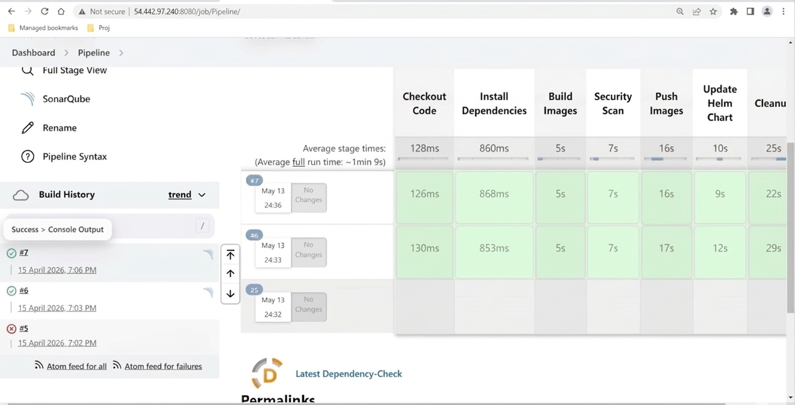
</p>

---

## 🚀 CI/CD Pipeline Overview

In this project, we implement a modern **CI/CD pipeline** using:

* **CI Tool:** Jenkins
* **CD Tool:** Argo CD

## ⚙️ What is Argo CD?

Argo CD is a **declarative, GitOps-based continuous delivery tool for Kubernetes**.

It works by continuously monitoring a Git repository that contains Kubernetes manifests (Helm charts, YAML files) and ensures that the cluster state always matches the desired state defined in Git.

👉 In simple words:
**Git is the source of truth, and Argo CD makes sure your cluster matches it automatically.**

---

## ❓ Why Use Argo CD?

Traditional deployment:

* Manual `kubectl apply` or `helm install`
* Risk of human errors ❌
* No proper tracking of changes ❌

With Argo CD:

* Fully automated deployments ✅
* Git-driven changes (version-controlled) ✅
* Easy rollback to previous versions ✅
---

## 🌟 Advantages of Argo CD

### 1. 🔄 GitOps-Based Deployment

* Uses Git as the **single source of truth**
* Every change is tracked and version-controlled

---

### 2. 🚀 Automated Sync

* Automatically syncs Kubernetes cluster with Git repo
* No need to manually run deployment commands

---

### 3. 🔍 Continuous Monitoring

* Detects drift between:

  * Desired state (Git)
  * Actual state (Cluster)
* Fixes it automatically

---

## 🔄 How CI/CD Works in This Project

1. Developer pushes code to GitHub
2. Jenkins pipeline triggers:

   * Build application
   * Create Docker image
   * Push image to AWS ECR
3. Update Helm manifests (image tag) in GitOps repo
4. Argo CD detects changes in Git
5. Argo CD Automatically deploys updated application to Kubernetes (EKS)

---


### 🚀 ArgoCD Implementation (GitOps Deployment)


### 📌 Step 1: Install ArgoCD using Helm

We installed ArgoCD in the Kubernetes cluster using Helm:

```bash
kubectl create namespace argocd

helm repo add argo https://argoproj.github.io/argo-helm
helm repo update

helm install argocd argo/argo-cd -n argocd
```
---

### 📌 Step 2: Access ArgoCD UI

After installation, we accessed the ArgoCD UI using port forwarding:

```bash
kubectl port-forward svc/argocd-server -n argocd 8080:443 
```
---
<p align="center">
  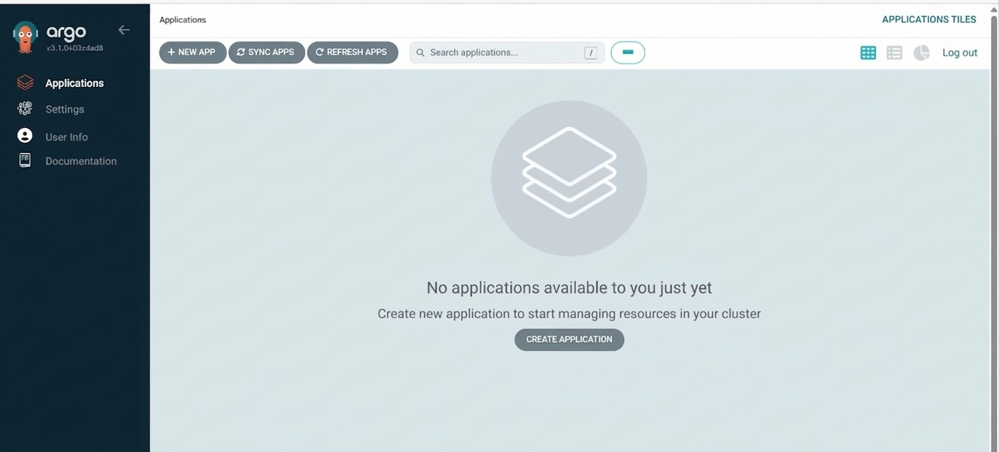
</p>

### 📌 Step 3: Install ArgoCD CLI

To manage ArgoCD from terminal, we installed the CLI:

```bash
curl -sSL -o argocd https://github.com/argoproj/argo-cd/releases/latest/download/argocd-linux-amd64
chmod +x argocd
mv argocd /usr/local/bin/
```

Login to ArgoCD server:

```bash
argocd login <argocd-server> <username> <password>
```

### 📌 Step 4: Add Kubernetes Cluster to ArgoCD

We registered our Kubernetes cluster with ArgoCD using CLI:

```bash
argocd cluster add <context-name>
```

This allows ArgoCD to deploy and manage applications on the cluster.

---

### 📌 Step 5: Create ArgoCD Application

#### 🔹 What is an ArgoCD Application?

* **Source** → Where your Kubernetes manifests/Helm charts are stored (Git repo)
* **Destination** → Where to deploy in the cluster
* **Sync Policy** → How ArgoCD keeps the cluster in sync with Git

ArgoCD continuously monitors Git and ensures that the cluster state always matches the desired state defined in the repository (GitOps principle).

[Application.yaml](argocd/argocd-app.yaml)

<p align="center">
  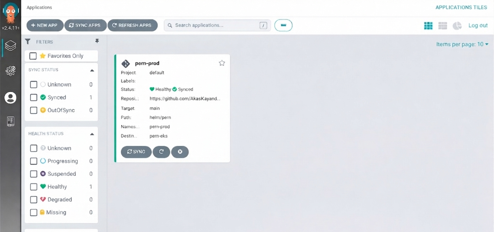
</p>
---

### ⚙️ How It Works (Flow)

1. Developer pushes code/Helm changes to GitHub
2. ArgoCD detects changes in repo
3. ArgoCD compares:

   * **Desired state (Git)** vs **Live state (Cluster)**
4. Automatically syncs changes to cluster
5. Ensures cluster is always up-to-date (GitOps)
---

## 📊 Implementation Of Monitoring using Prometheus & Grafana

### 🔍 What is Monitoring?

Monitoring is the process of continuously observing the performance, health, and behavior of an application and infrastructure. It helps track metrics like CPU usage, memory consumption, request rate, error rate, and system availability in real time.

---

### ❓ Why Monitoring is Important?

Monitoring is a critical part of any production system because it helps to:

* ✅ Detect issues before they impact users
* 📉 Identify performance bottlenecks
* 🚨 Set up alerts for failures or downtime
* 📊 Analyze system behavior and usage trends
* 🔧 Improve reliability and scalability

Without monitoring, it becomes very difficult to understand what’s happening inside your system.

---

### ⚙️ What is Prometheus?

**Prometheus** is an open-source monitoring and alerting toolkit designed for reliability and scalability.

#### 🔹 Key Features:

* Pull-based metrics collection (scrapes data from services)
* Powerful query language (**PromQL**)
* Time-series database for storing metrics

---

### 📈 What is Grafana?

**Grafana** is an open-source visualization tool used to display monitoring data in the form of dashboards.

#### 🔹 Key Features:

* Beautiful and interactive dashboards
* Supports multiple data sources (Prometheus, MySQL, etc.)
* Real-time monitoring visualization
---
## Step by Step Implementation

## 🔵 Step 3: Install Monitoring Stack

We use **kube-prometheus-stack**, which includes:

* 🧠 **Prometheus** – Metrics collection & storage
* 📊 **Grafana** – Visualization & dashboards
* 🚨 **Alertmanager** – Alert handling & notifications
* 🧲 **Node Exporter** – Node-level metrics
* 📦 **kube-state-metrics** – Kubernetes object metrics

### Add Helm Repository

```bash
helm repo add prometheus-community https://prometheus-community.github.io/helm-charts
helm repo update
```

### Deploy Monitoring Stack

```bash
kubectl create ns monitoring

helm install monitoring prometheus-community/kube-prometheus-stack \
  -n monitoring 
```

### Verify Installation

```bash
kubectl get pods -n monitoring
kubectl get svc -n monitoring
```

<p align="center">
  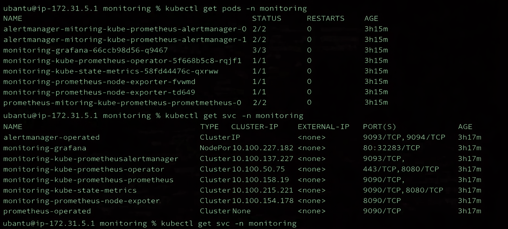
</p>

---

## 🌐 Access Monitoring UIs

### 🔐 Access Prometheus

```bash
kubectl port-forward svc/prometheus-operated -n monitoring 9090:9090
```

<p align="center">
  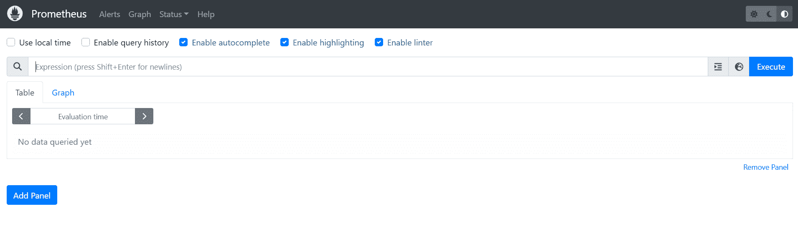
</p>

---
### 🔐 Access Grafana

```bash
kubectl port-forward svc/monitoring-grafana -n monitoring 8080:80
```


<p align="center">
  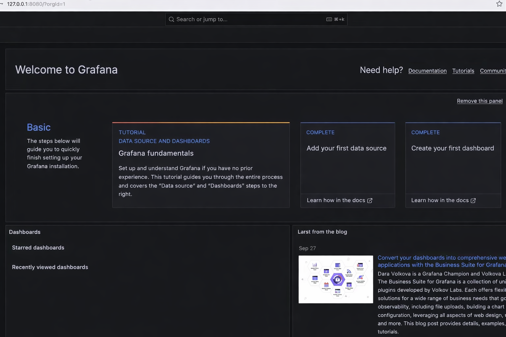
</p>

---
## 📈 Cluster Monitoring Flow

1. **Node Exporter** exposes node-level metrics (CPU, memory, disk)
2. **kube-state-metrics** exposes Kubernetes resource metrics (pods, deployments, configmaps, secrets)
3. **Prometheus** scrapes metrics and stores them in a format **time-series database**
4. Metrics can be queried using **PromQL**
5. **PromQL** (Prometheus Query Language) is a powerful and flexible query language used to query data from Prometheus.

<p align="center">
  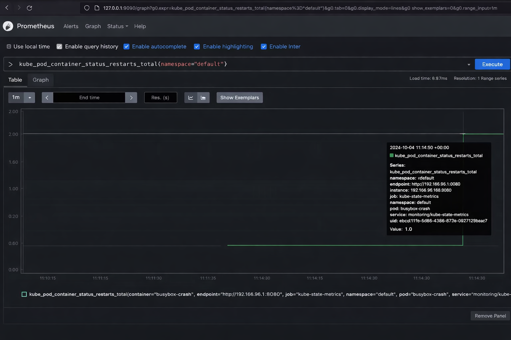
</p>

---

> ⚠️ **Problem =>** Prometheus UI is good for querying,but representation of data is not too good & not ideal for visualization,
> ✅ **solution => Grafana** 

### 📈 Grafana is a powerful dashboard and visualization tool that integrates with Prometheus to provide rich, customizable visualizations of the metrics data.
---

## 📊 Grafana Dashboards (Cluster)
---
* Add **Prometheus as a data source** in Grafana
### 📌 Step 1:Custom Grafana Dashboard

* we create a **custom Grafana dashboard** to:

* Understand how PromQL works
* Learn how panels, queries, and visualizations are configured
---

<p align="center">
  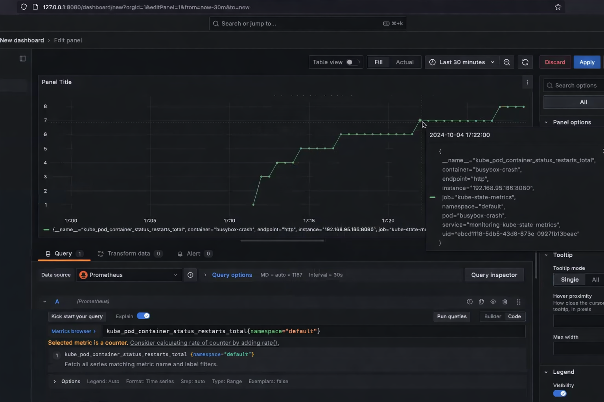
</p>
---
<p align="center">
  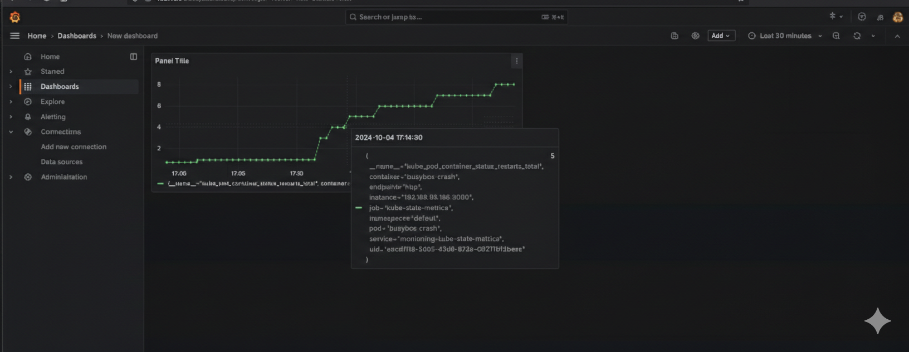
</p>
---

## 🧩 Application-Level Monitoring

### Why Application Metrics?

* we also need to monitor applications running inside the cluster.
* HTTP request count
* Latency
* Error rate
* App CPU & memory usage of Application

* Cluster metrics are not enough. We also need:

* Custom Metrics: You can instrument your application to expose custom metrics that are relevant to your specific use case. 

---

## ⚙️ Expose Application Metrics (Node.js)

### Install Prometheus Client in Backend App

```bash
npm install prom-client
```

### Instrument Application

* Add `app-metrics.js` Code in Node.js backend
* Expose metrics at `/metrics`
[app-matrix.js](https://github.com/Akashkayande/app-code-jenkins/blob/main/server/app-matrix.js)

> At this stage, metrics are exposed but **not scraped** by Prometheus

---

## 🔍 ServiceMonitor (Auto-Scraping)

To allow Prometheus to scrape application metrics:

```bash
kubectl apply -f serviceMonitor.yaml
```
[serviceMonitor.yaml](helm/pern/templates/service-monitor.yaml)
### Result

* Prometheus automatically scrapes app metrics
* Metrics are stored in TSDB
* Accessible via PromQL
---
<p align="center">
  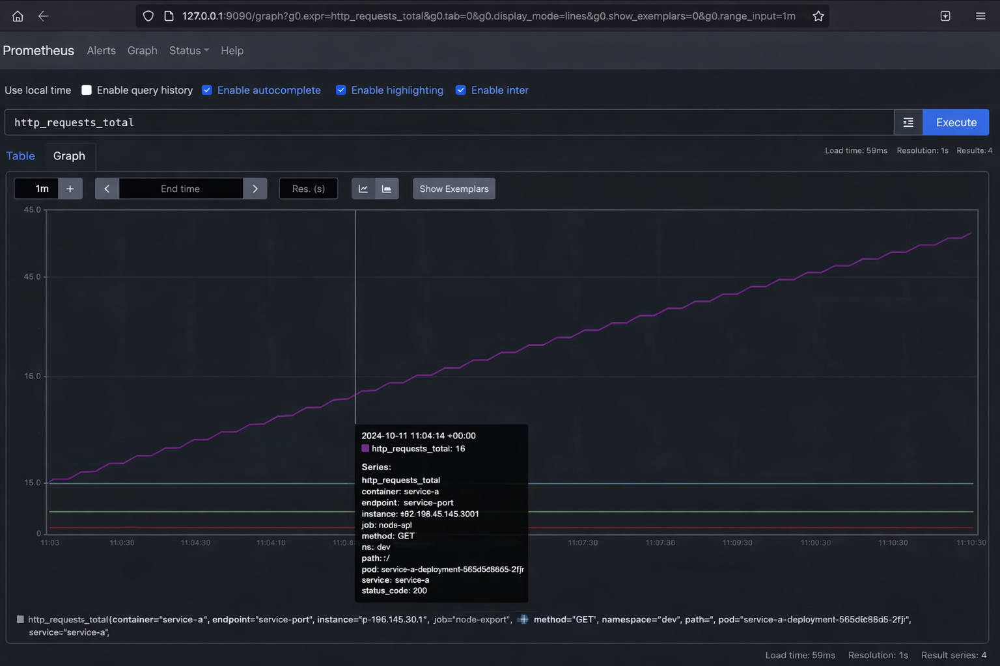
</p>
---

## 🧑‍💻 Author

**Akash Kayande**
DevOps Engineer | AWS | Kubernetes | CI/CD | GitOps

---

## ⭐ If you like this project

Give it a ⭐ on GitHub and feel free to fork or raise issues!


